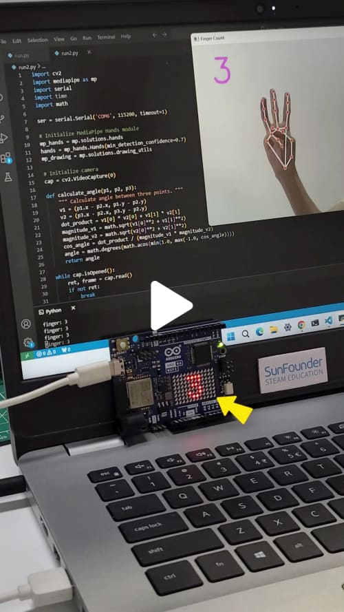
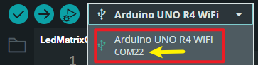
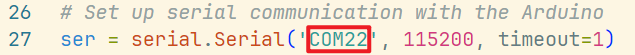

# UNO R4 WiFi Finger Gesture-Controlled LED Matrix Display

This project controls the LED matrix on an Arduino Uno R4 WiFi using finger count data from a Python script. The script detects the number of fingers shown to a camera and sends the count to the Arduino via USB serial communication, which then displays the number on the LED matrix.

<a href="https://www.tiktok.com/@sunfounder_official/video/7424698697100954910" title="Control the @Arduino Uno R4 WiFi's onboard LED matrix with fingers using Python & Arduino" target="_blank">
    
</a>

## Components

| Component Introduction         | Purchase Link  |
|--------------------------------|----------------|
| [Arduino Uno R4 WiFi](https://docs.sunfounder.com/projects/elite-explorer-kit/en/latest/components/component_uno.html#uno-r4-wifi)       | -              |

## Setup Instructions

> [!IMPORTANT]
> This project requires both Arduino and Python development environments. This tutorial assumes you already have Python and the Arduino IDE installed on your computer. If not, you can follow the installation guides provided below:

- [Arduino IDE Installation Guide](https://docs.arduino.cc/software/ide/)
- [Python Installation Guide](https://wiki.python.org/moin/BeginnersGuide/Download)

In this project, Arduino and Python each play crucial roles:

- **Arduino**: Arduino acts as the core of the hardware control. It receives instructions from the Python script and controls the LED matrix based on the number of fingers detected. Arduino communicates with the computer via serial port and responds in real-time to the data sent by the Python script.

- **Python**: The Python script is responsible for image processing and gesture recognition. It uses the computer's camera to detect the number of fingers being shown. The Python script leverages OpenCV to analyze the image and determine the finger count. It then sends this data to the Arduino via serial communication, triggering the appropriate LED control.

### Arduino Setup

1. Build the Circuit
2. Open the `LedMatrixController.ino` file in the Arduino IDE.
3. Connect your Arduino Uno to your computer via USB. **Note the port number, as you'll need it for the Python script.**

   

4. Upload the `LedMatrixController.ino` sketch to the Arduino board.

### Python Setup

> [!IMPORTANT]
> Before you run the Python code, ensure that you've closed the Serial Monitor in the Arduino IDE. This will prevent any port conflicts that could stop Python from sending data to your Arduino.

1. Install the necessary Python libraries:

   ```bash
   pip install opencv-python mediapipe pyserial
   ```

2. Update the Python script to use the correct serial port, ensuring it matches the one identified during Arduino setup.

   

3. Run `FingerCountSender.py`.

## Join Our Community

Join SunFounder Raspberry Pi & Arduino & ESP32 Enthusiasts Community on Facebook! Connect fellow enthusiasts explore more about these platforms.

[Join Now](https://www.facebook.com/share/LDYGqFDKJC7G4V5M/?mibextid=CTbP7E)
