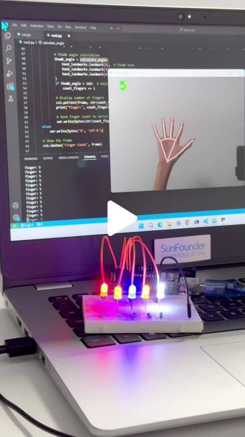
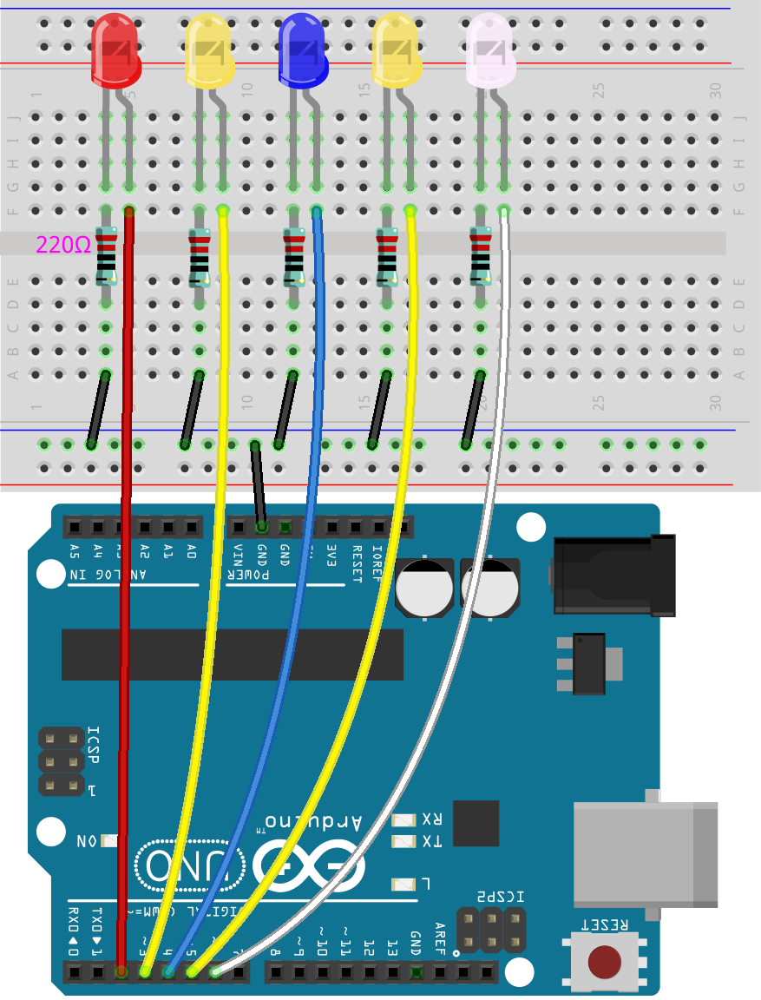

# Arduino LED Control Using Finger Count

This project uses an Arduino Uno to control LEDs based on finger count data received from a computer. A Python script detects the number of fingers shown to a camera and sends this data to the Arduino, which lights up the corresponding number of LEDs.

[](https://www.tiktok.com/@sunfounder_official/video/7406884460253220126 "Arduino LED Control Using Finger Count - SunFounder Tiktok")

## Components

| Component Introduction         | Purchase Link  |
|--------------------------------|----------------|
| [Arduino Uno R3(or R4)](https://docs.sunfounder.com/projects/elite-explorer-kit/en/latest/components/component_uno.html#uno-r4-wifi)       | -              |
| [LEDs](https://docs.sunfounder.com/projects/elite-explorer-kit/en/latest/components/component_led.html#cpn-led)                     | [BUY](https://www.sunfounder.com/products/500pcs-5-colors-x-100pcs-5mm-leds-with-white-red-yellow-green-blue-colors-kit-box?ref=tiktok1&utm_source=github)       |
| [Resistors](https://docs.sunfounder.com/projects/elite-explorer-kit/en/latest/components/component_resistor.html#cpn-resistor)                | [BUY](https://www.sunfounder.com/products/1-4w-resistor-assortment-kit-40-values-400pcs?ref=tiktok1&utm_source=github)       |
| [Breadboard](https://docs.sunfounder.com/projects/elite-explorer-kit/en/latest/components/component_breadboard.html#cpn-breadboard)              | [BUY](https://www.sunfounder.com/products/sunfounder-breadboard-kit?ref=tiktok1&utm_source=github)       |
| [Jumper Wires](https://docs.sunfounder.com/projects/elite-explorer-kit/en/latest/components/component_wires.html#cpn-wires)              | [BUY](https://www.sunfounder.com/products/560pcs-jumper-wire-kit-with-14-lengths?ref=tiktok1&utm_source=github)       |

## Circuit Diagram

Refer to the diagram below to set up the circuit:



## Setup Instructions

> [!IMPORTANT]
> This project requires both Arduino and Python development environments. This tutorial assumes you already have Python and the Arduino IDE installed on your computer. If not, you can follow the installation guides provided below:

- [Arduino IDE Installation Guide](https://docs.arduino.cc/software/ide/)
- [Python Installation Guide](https://wiki.python.org/moin/BeginnersGuide/Download)

In this project, Arduino and Python each play crucial roles:

- **Arduino**: Arduino acts as the core of the hardware control. It receives instructions from the Python script and controls the LEDs based on the number of fingers detected. Arduino communicates with the computer via serial port and responds in real-time to the data sent by the Python script.

- **Python**: The Python script is responsible for image processing and gesture recognition. It uses the computer's camera to detect the number of fingers being shown. The Python script leverages OpenCV to analyze the image and determine the finger count. It then sends this data to the Arduino via serial communication, triggering the appropriate LED control.

### Arduino

1. Build the Circuit
2. Open the `LedController.ino` file in the Arduino IDE.
3. Connect your Arduino Uno to your computer via USB.
4. Upload the `LedController.ino` sketch to the Arduino board.

### Python

1. Install the necessary Python libraries:

   ```bash
   pip install opencv-python mediapipe pyserial
   ```

2. Ensure code is modified to use correct serial port.
3. Run `FingerCountSender.py`.

## Join Our Community

Join SunFounder Raspberry Pi & Arduino & ESP32 Enthusiasts Community on Facebook! Connect fellow enthusiasts explore more about these platforms.

[Join Now](https://www.facebook.com/share/LDYGqFDKJC7G4V5M/?mibextid=CTbP7E)