# Arduino Lidar Project

This project creates a simple lidar system using an Arduino Uno, a servo motor, and an Time of Flight Micro-LIDAR Distance Sensor(VL53L0X). The lidar scans the environment, measures distances, and visualizes the data in real-time using the [Processing IDE](https://processing.org).

## Components

| Component Introduction         | Purchase Link  |
|--------------------------------|----------------|
| [Arduino Uno R4(or R3)](https://docs.sunfounder.com/projects/elite-explorer-kit/en/latest/components/component_uno.html#uno-r4-wifi)       | -              |
| [Time of Flight Micro-LIDAR Distance Sensor (VL53L0X)](https://docs.sunfounder.com/projects/umsk/en/latest/01_components_basic/21-component_VL53L0X.html#time-of-flight-micro-lidar-distance-sensor-vl53l0x)         | [BUY](https://www.sunfounder.com/products/vl53l0x-time-of-flight-distance-sensor-laser-ranging-module?ref=tiktok1&utm_source=github)       |
| [Servo](https://docs.sunfounder.com/projects/elite-explorer-kit/en/latest/components/component_servo.html#cpn-servo)                     | [BUY](https://www.sunfounder.com/products/sg90-micro-digital-servo?ref=tiktok1&utm_source=github)       |
| [Breadboard](https://docs.sunfounder.com/projects/elite-explorer-kit/en/latest/components/component_breadboard.html#cpn-breadboard)                | [BUY](https://www.sunfounder.com/products/sunfounder-breadboard-kit?ref=tiktok1&utm_source=github)       |
| [Jumper Wires](https://docs.sunfounder.com/projects/elite-explorer-kit/en/latest/components/component_wires.html#cpn-wires)              | [BUY](https://www.sunfounder.com/products/560pcs-jumper-wire-kit-with-14-lengths?ref=tiktok1&utm_source=github)       |

## Circuit Diagram

Refer to the image below for the circuit setup:

We designed a connector for this project to easily fix the servo and VL53L0X sensor, which you can download and 3D print yourself.

https://www.tinkercad.com/things/3LvRsbhjXWM-arduinolidarpart

## Setup Instructions

```mermaid
flowchart LR
    %% Define custom styles
    classDef component fill:#f9f9f9,stroke:#666,stroke-width:2px,rx:8

    %% Hardware components group
    subgraph Sensors ["Hardware"]
        direction TB
        sensor["📡 VL53L0X<br/>ToF Sensor"]:::component
        servo["⚙️ Servo<br/>Motor"]:::component
    end

    %% Arduino and Processing
    controller["Arduino<br/>Controller"]:::component
    processing["💻 Processing<br/>Radar Display"]:::component

    %% Connections
    sensor -->|"I2C Data"| controller
    controller --> |"PWM Control"| servo
    controller -->|"Serial Data<br/>(Angle,Distance.)"| processing

    %% Style the components
    style sensor fill:#fff5f5,stroke:#FF6B6B,stroke-width:2px
    style servo fill:#fff5f5,stroke:#FF6B6B,stroke-width:2px
    style controller fill:#f0faf9,stroke:#4ECDC4,stroke-width:2px
    style processing fill:#f0f7fa,stroke:#45B7D1,stroke-width:2px
    style Sensors fill:#fff,stroke:none

    %% Style the links
    linkStyle 0 stroke:#FF6B6B,stroke-width:2px;
    linkStyle 1 stroke:#FF6B6B,stroke-width:2px;
    linkStyle 2 stroke:#45B7D1,stroke-width:2px;
```

1. Build the circuit.
2. Upload `ArduinoLidar.ino` to the Arduino board using [Arduino IDE](https://www.arduino.cc/en/software).
3. In the Arduino IDE, check the current Arduino port.
   
   
5. Open `ArduinoLidarGUI.pde` in the [Processing IDE](https://processing.org/).
6. **Modify the code in line 35 to ensure the correct port number**.
   
   
8. Run the Processing sketch to visualize the sonar data.

## Arduino Code

> [!IMPORTANT]
> To install the library, use the Arduino Library Manager and search for “**Adafruit_VL53L0X**” and install it.

The Arduino code is located in the `ArduinoLidar` folder as `ArduinoLidar.ino`. This code controls the servo motor to rotate the ToF distance sensor and measure distances, sending the data to the serial port.

## Processing GUI

The Processing GUI code is in the `ArduinoLidarGUI` folder. The files include:

- `ArduinoLidarGUI.pde`: Main Processing code for visualizing sonar data. Reads data from the serial port and visualizes it.
- `OCRAExtended-30.vlw`: Font file used by the Processing sketch.

## Join Our Community

Welcome to the SunFounder Raspberry Pi & Arduino & ESP32 Enthusiasts Community on Facebook! Dive deeper into Raspberry Pi, Arduino, and ESP32 with fellow enthusiasts.

https://www.facebook.com/share/LDYGqFDKJC7G4V5M/?mibextid=CTbP7E

## Acknowledgments

This project is based on a tutorial from [How To Mechatronics](https://howtomechatronics.com/projects/arduino-radar-project/). Special thanks for providing the detailed guide and resources.
