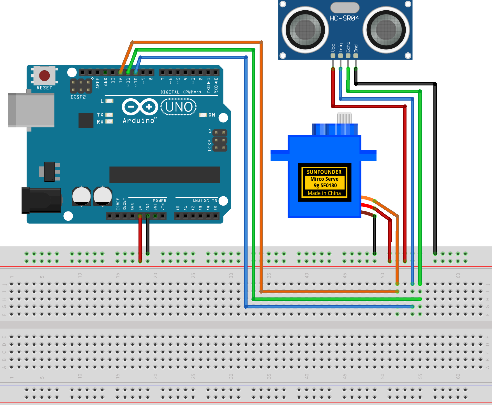

# Arduino Radar Project

This project creates a simple radar system using an Arduino Uno, a servo motor, and an ultrasonic sensor (HC-SR04). The radar scans the environment, measures distances, and visualizes the data in real-time using the Processing IDE.

## Components

- Arduino Uno R4 (or R3)
- Ultrasonic Distance Sensor (HC-SR04)
- Servo Motor
- Connecting wires
- Breadboard

## Circuit Diagram

Refer to the image below for the circuit setup:

## Setup Instructions

1. Build the circuit.
2. Upload `ArduinoRadar.ino` to the Arduino board.
3. In the Arduino IDE, check the current Arduino port.
   
4. Open `ArduinoRadarGUI.pde` in the [Processing IDE](https://processing.org/).
5. **Modify the code in line 35 to ensure the correct port number**.
   
6. Run the Processing sketch to visualize the radar data.

## Arduino Code

The Arduino code is located in the `ArduinoRadar` folder as `ArduinoRadar.ino`. This code controls the servo motor to rotate the ultrasonic sensor and measure distances, sending the data to the serial port.

## Processing GUI

The Processing GUI code is in the `ArduinoRadarGUI` folder. The files include:

- `ArduinoRadarGUI.pde`: Main Processing code for visualizing radar data.
- `OCRAExtended-30.vlw`: Font file used by the Processing sketch.

## Join Our Community

Welcome to the SunFounder Raspberry Pi & Arduino & ESP32 Enthusiasts Community on Facebook! Dive deeper into Raspberry Pi, Arduino, and ESP32 with fellow enthusiasts.

https://www.facebook.com/share/LDYGqFDKJC7G4V5M/?mibextid=CTbP7E

## Acknowledgments

This project is based on a tutorial from [How To Mechatronics](https://howtomechatronics.com/projects/arduino-radar-project/). Special thanks for providing the detailed guide and resources.

