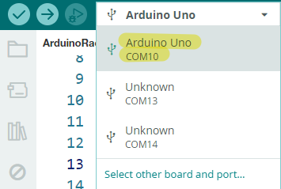

# Arduino Sonar Project V1.2

This project implements a basic radar system using an Arduino Uno, a servo motor, an ultrasonic sensor (HC-SR04), an LED, and a buzzer. The system scans the environment by rotating the ultrasonic sensor between 15 and 165 degrees, measuring distances to nearby objects. If an object is detected within 15 cm, an LED lights up, and a buzzer sounds. The angle and distance data are sent to the serial port, allowing for real-time visualization using the Processing IDE.

## Components

| Component Introduction         | Purchase Link  |
|--------------------------------|----------------|
| [Arduino Uno R4(or R3)](https://docs.sunfounder.com/projects/elite-explorer-kit/en/latest/components/component_uno.html#uno-r4-wifi)       | -              |
| [Ultrasonic Module](https://docs.sunfounder.com/projects/elite-explorer-kit/en/latest/components/component_ultrasonic_sensor.html#cpn-ultrasonic)         | [BUY](https://www.sunfounder.com/products/5pcs-hc-sr04-ultrasonic-module-distance-sensor?ref=tiktok1&utm_source=github)       |
| [Servo](https://docs.sunfounder.com/projects/elite-explorer-kit/en/latest/components/component_servo.html#cpn-servo)                     | [BUY](https://www.sunfounder.com/products/sg90-micro-digital-servo?ref=tiktok1&utm_source=github)       |
| [Breadboard](https://docs.sunfounder.com/projects/elite-explorer-kit/en/latest/components/component_breadboard.html#cpn-breadboard)                | [BUY](https://www.sunfounder.com/products/sunfounder-breadboard-kit?ref=tiktok1&utm_source=github)       |
| [Jumper Wires](https://docs.sunfounder.com/projects/elite-explorer-kit/en/latest/components/component_wires.html#cpn-wires)              | [BUY](https://www.sunfounder.com/products/560pcs-jumper-wire-kit-with-14-lengths?ref=tiktok1&utm_source=github)       |
| [Resistor](https://docs.sunfounder.com/projects/elite-explorer-kit/en/latest/components/component_resistor.html#cpn-resistor)              | [BUY](https://www.sunfounder.com/products/1-4w-resistor-assortment-kit-40-values-400pcs?ref=tiktok1&utm_source=github)       |
| [Transistor](https://docs.sunfounder.com/projects/elite-explorer-kit/en/latest/components/component_transistor.html#cpn-transistor)              | [BUY](https://www.sunfounder.com/products/10-values-200pcs-power-supply-general-transistor-npn-pnp-assortment-kit-bc337-bc327-2n2222-2n2907-2n3904-2n3906-s8050-s8550-a1015-c1815-set?ref=tiktok1&utm_source=github)       |
| [Buzzer](https://docs.sunfounder.com/projects/elite-explorer-kit/en/latest/components/component_buzzer.html#cpn-buzzer)              | [BUY](https://www.sunfounder.com/products/20pcs-3-5v-2-terminals-passive-buzzer?ref=tiktok1&utm_source=github)       |

## Circuit Diagram

Refer to the image below for the circuit setup:

## Setup Instructions

1. Build the circuit.
2. Upload `ArduinoSonar.ino` to the Arduino board using [Arduino IDE](https://www.arduino.cc/en/software).
3. In the Arduino IDE, check the current Arduino port.
   
   
5. Open `ArduinoSonarGUI.pde` in the [Processing IDE](https://processing.org/).
6. **Modify the code in line 35 to ensure the correct port number**.
   
   
8. Run the Processing sketch to visualize the sonar data.

## Arduino Code

The Arduino code is located in the `ArduinoSonar` folder as `ArduinoSonar.ino`. This code controls the servo motor to rotate the ultrasonic sensor and measure distances, sending the data to the serial port.

## Processing GUI

The Processing GUI code is in the `ArduinoSonarGUI` folder. The files include:

- `ArduinoSonarGUI.pde`: Main Processing code for visualizing sonar data. Reads data from the serial port and visualizes it.
- `OCRAExtended-30.vlw`: Font file used by the Processing sketch.

## Join Our Community

Welcome to the SunFounder Raspberry Pi & Arduino & ESP32 Enthusiasts Community on Facebook! Dive deeper into Raspberry Pi, Arduino, and ESP32 with fellow enthusiasts.

https://www.facebook.com/share/LDYGqFDKJC7G4V5M/?mibextid=CTbP7E

## Acknowledgments

This project is based on a tutorial from [How To Mechatronics](https://howtomechatronics.com/projects/arduino-radar-project/). Special thanks for providing the detailed guide and resources.
