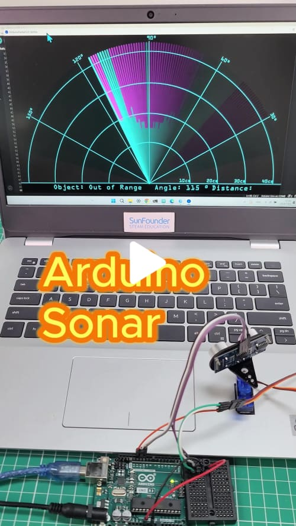
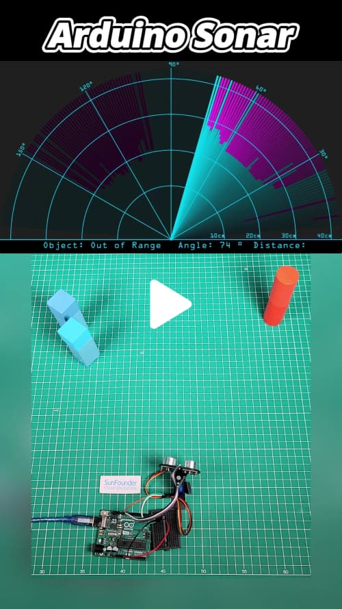
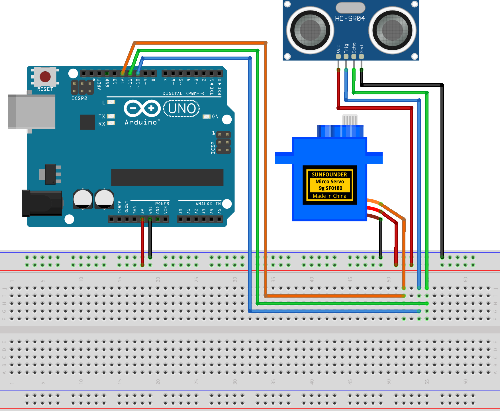
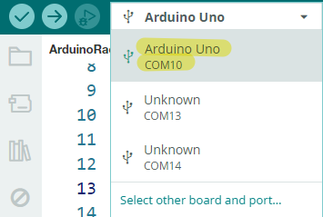
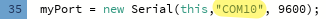

# Arduino Sonar Project

This project creates a simple sonar system using an Arduino Uno, a servo motor, and an ultrasonic sensor (HC-SR04). The sonar scans the environment, measures distances, and visualizes the data in real-time using the Processing IDE.

## Components

| Component Introduction         | Purchase Link  |
|--------------------------------|----------------|
| [Arduino Uno R4(or R3)](https://docs.sunfounder.com/projects/elite-explorer-kit/en/latest/components/component_uno.html#uno-r4-wifi)       | -              |
| [Ultrasonic Module](https://docs.sunfounder.com/projects/elite-explorer-kit/en/latest/components/component_ultrasonic_sensor.html#cpn-ultrasonic)         | [BUY](https://www.sunfounder.com/products/5pcs-hc-sr04-ultrasonic-module-distance-sensor?ref=tiktok1&utm_source=github)       |
| [Servo](https://docs.sunfounder.com/projects/elite-explorer-kit/en/latest/components/component_servo.html#cpn-servo)                     | [BUY](https://www.sunfounder.com/products/sg90-micro-digital-servo?ref=tiktok1&utm_source=github)       |
| [Breadboard](https://docs.sunfounder.com/projects/elite-explorer-kit/en/latest/components/component_breadboard.html#cpn-breadboard)                | [BUY](https://www.sunfounder.com/products/sunfounder-breadboard-kit?ref=tiktok1&utm_source=github)       |
| [Jumper Wires](https://docs.sunfounder.com/projects/elite-explorer-kit/en/latest/components/component_wires.html#cpn-wires)              | [BUY](https://www.sunfounder.com/products/560pcs-jumper-wire-kit-with-14-lengths?ref=tiktok1&utm_source=github)       |

## Circuit Diagram

Refer to the image below for the circuit setup:

## Setup Instructions

1. Build the circuit.
2. Upload `ArduinoSonar.ino` to the Arduino board using [Arduino IDE](https://www.arduino.cc/en/software).
3. In the Arduino IDE, check the current Arduino port.
   
   
5. Open `ArduinoSonarGUI.pde` in the [Processing IDE](https://processing.org/).
6. **Modify the code in line 35 to ensure the correct port number**.
   
   
8. Run the Processing sketch to visualize the sonar data.

## Arduino Code

The Arduino code is located in the `ArduinoSonar` folder as `ArduinoSonar.ino`. This code controls the servo motor to rotate the ultrasonic sensor and measure distances, sending the data to the serial port.

## Processing GUI

The Processing GUI code is in the `ArduinoSonarGUI` folder. The files include:

- `ArduinoSonarGUI.pde`: Main Processing code for visualizing sonar data. Reads data from the serial port and visualizes it.
- `OCRAExtended-30.vlw`: Font file used by the Processing sketch.

## Join Our Community

Welcome to the SunFounder Raspberry Pi & Arduino & ESP32 Enthusiasts Community on Facebook! Dive deeper into Raspberry Pi, Arduino, and ESP32 with fellow enthusiasts.

https://www.facebook.com/share/LDYGqFDKJC7G4V5M/?mibextid=CTbP7E

## Acknowledgments

This project is based on a tutorial from [How To Mechatronics](https://howtomechatronics.com/projects/arduino-radar-project/). Special thanks for providing the detailed guide and resources.
