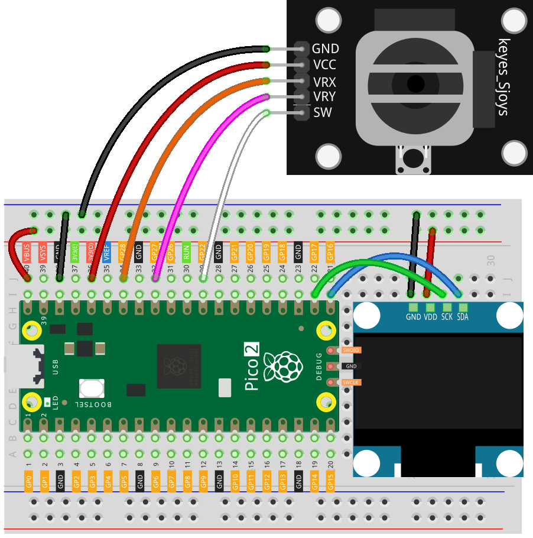

# Joystick Controlled OLED Eyes - Raspberry Pi Pico2

 This project animates a pair of interactive eyes on an OLED screen, controlled by a joystick. The eyes track the joystick's movement, simulating the effect of following an object within a defined range. Pressing the joystick button triggers a blinking animation that mimics a natural blink by covering the upper part of the eyes.

## Components

| Component Introduction         | Purchase Link  |
|--------------------------------|----------------|
| Raspberry Pi Pico 2      | -              |
| [OLED Display Module (SSD1306)](https://docs.sunfounder.com/projects/umsk/en/latest/01_components_basic/27-component_oled.html)       | -              |
| [Joystick Module](https://docs.sunfounder.com/projects/umsk/en/latest/01_components_basic/09-component_joystick.html#joystick-module)       | [BUY](https://www.sunfounder.com/products/dual-axis-button-joystick-module-ps2-game?ref=tiktok1&utm_source=github)               |
| [Breadboard](https://docs.sunfounder.com/projects/umsk/en/latest/01_components_basic/38-component_breadboard.html#breadboard)                | [BUY](https://www.sunfounder.com/products/20pcs-3-5v-2-terminals-passive-buzzer?ref=tiktok1&utm_source=github)       |
| [Jumper Wires](https://docs.sunfounder.com/projects/elite-explorer-kit/en/latest/components/component_wires.html#cpn-wires)              | [BUY](https://www.sunfounder.com/products/560pcs-jumper-wire-kit-with-14-lengths?ref=tiktok1&utm_source=github)       |

## Circuit Diagram

Refer to the image below for the circuit setup:



## Arduino Code

Open the `Joystick_Controlled_OLED_Eyes.ino` file in the `Joystick_Controlled_OLED_Eyes` folder.

> [!IMPORTANT]
> To install the library, use the Arduino Library Manager and search for “**Adafruit SSD1306**” and “**Adafruit GFX**” and install it.

```c++
#include <Wire.h>
#include <Adafruit_GFX.h>
#include <Adafruit_SSD1306.h>

#define SCREEN_WIDTH 128  // OLED display width, in pixels
#define SCREEN_HEIGHT 64  // OLED display height, in pixels
#define OLED_RESET -1     // Reset pin (not used, so set to -1)

Adafruit_SSD1306 display(SCREEN_WIDTH, SCREEN_HEIGHT, &Wire, OLED_RESET);

int eyeAreaRadius = 18;     // Radius of the entire eye area
int pupilRadius = 6;        // Radius of the pupil
int reflectionRadius1 = 2;  // Radius of the first reflection spot
int reflectionRadius2 = 1;  // Radius of the second reflection spot
int eyeMovementMargin = 5;  // Margin to prevent the pupil from touching the eye edges

const int buttonPin = 22;  // Pin number for the joystick button
const int xPin = A2;      // Pin number for X-axis input from joystick
const int yPin = A1;      // Pin number for Y-axis input from joystick
const int sda = 16;
const int sck = 17;

bool isBlinking = false;  // Flag to track if the eyes are blinking

// Left eye parameters
int leftEyeX, leftEyeY;
int leftEyeCenterX = SCREEN_WIDTH / 2 - 20;  // X-coordinate of the left eye's center
int leftEyeCenterY = SCREEN_HEIGHT / 2;      // Y-coordinate of the left eye's center
int leftEyeMaxX = leftEyeCenterX + eyeAreaRadius - pupilRadius - eyeMovementMargin;
int leftEyeMinX = leftEyeCenterX - eyeAreaRadius + pupilRadius + eyeMovementMargin;
int leftEyeMaxY = leftEyeCenterY + eyeAreaRadius - pupilRadius - eyeMovementMargin;
int leftEyeMinY = leftEyeCenterY - eyeAreaRadius + pupilRadius + eyeMovementMargin;

// Right eye parameters
int rightEyeX, rightEyeY;
int rightEyeCenterX = SCREEN_WIDTH / 2 + 20;  // X-coordinate of the right eye's center
int rightEyeCenterY = SCREEN_HEIGHT / 2;      // Y-coordinate of the right eye's center
int rightEyeMaxX = rightEyeCenterX + eyeAreaRadius - pupilRadius - eyeMovementMargin;
int rightEyeMinX = rightEyeCenterX - eyeAreaRadius + pupilRadius + eyeMovementMargin;
int rightEyeMaxY = rightEyeCenterY + eyeAreaRadius - pupilRadius - eyeMovementMargin;
int rightEyeMinY = rightEyeCenterY - eyeAreaRadius + pupilRadius + eyeMovementMargin;

void setup() {
  pinMode(xPin, INPUT);              // Set pin A0 for X-axis input from joystick
  pinMode(yPin, INPUT);              // Set pin A1 for Y-axis input from joystick
  pinMode(buttonPin, INPUT_PULLUP);  // Set button pin as input with internal pull-up resistor

  Wire.setSDA(sda);
  Wire.setSCL(sck);

  if (!display.begin(SSD1306_SWITCHCAPVCC, 0x3C)) {
    Serial.println(F("SSD1306 allocation failed"));
    for (;;)
      ;  // Stop if the display initialization fails
  }

  display.clearDisplay();  // Clear the display buffer
  display.display();       // Display the cleared buffer (turn off all pixels)
}

void loop() {
  int xValue = analogRead(xPin);             // Read the X-axis value from the joystick
  int yValue = analogRead(yPin);             // Read the Y-axis value from the joystick
  int buttonState = digitalRead(buttonPin);  // Read the state of the button

  //DEBUG
  // Serial.print(xValue);
  // Serial.print(",");
  // Serial.println(yValue);

  // Map joystick values to left eye's pupil position within its allowed range
  leftEyeX = map(xValue, 0, 1023, leftEyeMinX, leftEyeMaxX);
  leftEyeY = map(yValue, 0, 1023, leftEyeMinY, leftEyeMaxY);

  // Map joystick values to right eye's pupil position within its allowed range
  rightEyeX = map(xValue, 0, 1023, rightEyeMinX, rightEyeMaxX);
  rightEyeY = map(yValue, 0, 1023, rightEyeMinY, rightEyeMaxY);

  // Check if the button is pressed to determine if the eyes should blink
  if (buttonState == LOW) {  // If the button is pressed
    isBlinking = true;
  } else {
    isBlinking = false;
  }

  display.clearDisplay();  // Clear the display buffer before drawing

  // Draw the left eye
  display.fillCircle(leftEyeCenterX, leftEyeCenterY, eyeAreaRadius, SSD1306_WHITE);  // Draw the eye area
  display.fillCircle(leftEyeX, leftEyeY, pupilRadius, SSD1306_BLACK);                // Draw the pupil
  display.fillCircle(leftEyeX - 2, leftEyeY - 2, reflectionRadius1, SSD1306_WHITE);  // Draw the first reflection
  display.fillCircle(leftEyeX + 1, leftEyeY + 1, reflectionRadius2, SSD1306_WHITE);  // Draw the second reflection

  // Draw the right eye
  display.fillCircle(rightEyeCenterX, rightEyeCenterY, eyeAreaRadius, SSD1306_WHITE);  // Draw the eye area
  display.fillCircle(rightEyeX, rightEyeY, pupilRadius, SSD1306_BLACK);                // Draw the pupil
  display.fillCircle(rightEyeX - 2, rightEyeY - 2, reflectionRadius1, SSD1306_WHITE);  // Draw the first reflection
  display.fillCircle(rightEyeX + 1, rightEyeY + 1, reflectionRadius2, SSD1306_WHITE);  // Draw the second reflection

  if (isBlinking) {
    // Draw the blinking effect (top half of the eyes black)
    display.fillRect(leftEyeCenterX - eyeAreaRadius, leftEyeCenterY - eyeAreaRadius, 2.5 * eyeAreaRadius, eyeAreaRadius, SSD1306_BLACK);
    display.fillRect(rightEyeCenterX - eyeAreaRadius, rightEyeCenterY - eyeAreaRadius, 2.5 * eyeAreaRadius, eyeAreaRadius, SSD1306_BLACK);
  }

  display.display();  // Update the display with the new drawings
  delay(50);          // Short delay to reduce flickering
}
```

## Join Our Community

Welcome to the SunFounder Raspberry Pi & Arduino & ESP32 Enthusiasts Community on Facebook! Dive deeper into Raspberry Pi, Arduino, and ESP32 with fellow enthusiasts.

https://www.facebook.com/share/LDYGqFDKJC7G4V5M/?mibextid=CTbP7E
