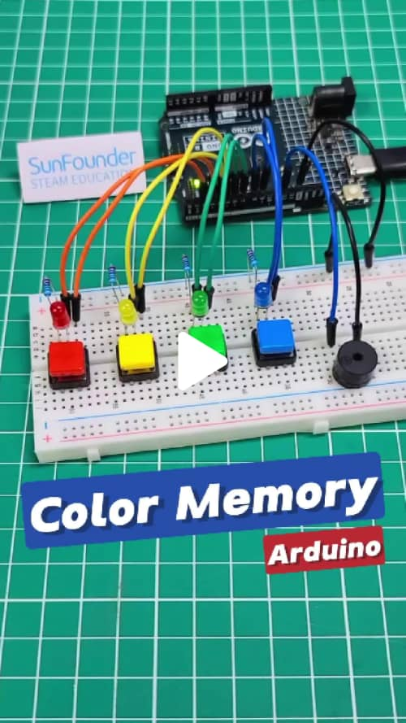
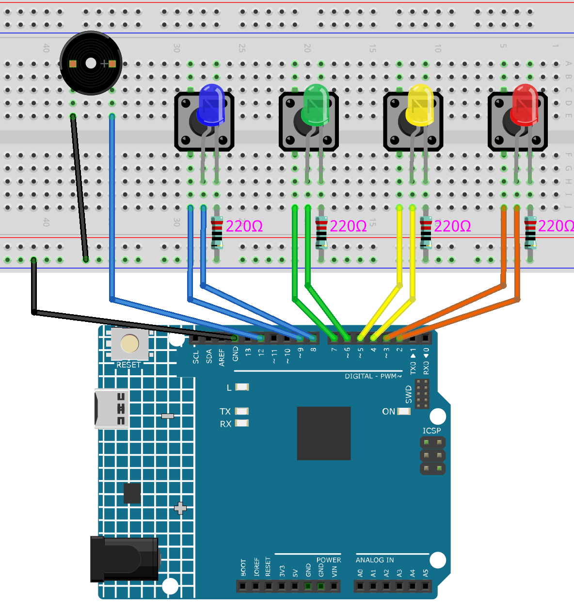

# Arduino Memory Game

This project is a memory game using an Arduino, LEDs, buttons, and a buzzer to simulate a "[Simon Game](https://en.wikipedia.org/wiki/Simon_(game))" experience. Players must repeat a random LED sequence that grows in length each round. The game randomly generates sequences of illuminated LEDs with corresponding sounds, and the player must press buttons in the correct order to advance. If an incorrect button is pressed, a game-over sequence is triggered, followed by a restart. The game dynamically adjusts its pace to provide a more challenging experience at each level.

<a href="https://www.instagram.com/reel/DB8GNLgRikC/#" title="DIY Arduino Memory Challenge Game – Can You Beat It?" target="_blank">
    
</a>


## Components

| Component Introduction         | Purchase Link  |
|--------------------------------|----------------|
| [Arduino Uno R4(or R3)](https://docs.sunfounder.com/projects/elite-explorer-kit/en/latest/components/component_uno.html#uno-r4-wifi)       | -              |
| [Button](https://docs.sunfounder.com/projects/elite-explorer-kit/en/latest/components/component_button.html#button)       | -              |
| [Active Buzzer](https://docs.sunfounder.com/projects/elite-explorer-kit/en/latest/components/component_buzzer.html#buzzer)       | -              |
| [LED](https://docs.sunfounder.com/projects/elite-explorer-kit/en/latest/basic_projects/10_basic_led.html)       | [BUY](https://www.sunfounder.com/products/500pcs-5-colors-x-100pcs-5mm-leds-with-white-red-yellow-green-blue-colors-kit-box?ref=tiktok1&utm_source=github)               |
| [Resistor](https://docs.sunfounder.com/projects/elite-explorer-kit/en/latest/components/component_resistor.html#resistor)       | [BUY](https://www.sunfounder.com/products/1-4w-resistor-assortment-kit-40-values-400pcs?ref=tiktok1&utm_source=github)               |
| [Breadboard](https://docs.sunfounder.com/projects/umsk/en/latest/01_components_basic/38-component_breadboard.html#breadboard)                | [BUY](https://www.sunfounder.com/products/20pcs-3-5v-2-terminals-passive-buzzer?ref=tiktok1&utm_source=github)       |
| [Jumper Wires](https://docs.sunfounder.com/projects/elite-explorer-kit/en/latest/components/component_wires.html#cpn-wires)              | [BUY](https://www.sunfounder.com/products/560pcs-jumper-wire-kit-with-14-lengths?ref=tiktok1&utm_source=github)       |

## Circuit Diagram

Refer to the image below for the circuit setup:



## Arduino Code

Open the `MemoryGame.ino` file in the `MemoryGame` folder.

```c++
// LED and button pin definitions
const int redLED = 2;
const int yellowLED = 4;
const int greenLED = 6;
const int blueLED = 8;
const int redButton = 3;
const int yellowButton = 5;
const int greenButton = 7;
const int blueButton = 9;
const int buzzer = 12;

int sequence[100]; // Store the random sequence
int playerInput[100]; // Store the player's input sequence
int level = 0; // Current game level
bool gameOver = false; // Flag to check if the game is over

void setup() {
  // Initialize pin modes
  pinMode(redLED, OUTPUT);
  pinMode(yellowLED, OUTPUT);
  pinMode(greenLED, OUTPUT);
  pinMode(blueLED, OUTPUT);
  
  pinMode(redButton, INPUT_PULLUP);
  pinMode(yellowButton, INPUT_PULLUP);
  pinMode(greenButton, INPUT_PULLUP);
  pinMode(blueButton, INPUT_PULLUP);
  
  pinMode(buzzer, OUTPUT);
  
  Serial.begin(9600); // Debugging purpose
  
  // Start the game
  startGame();
}

void loop() {
  if (!gameOver) {
    // Play the current color sequence
    playSequence();
    
    // Check player's input
    if (!getPlayerInput()) {
      endGame();
    } else {
      delay(500); // Shorten delay after player input
    }
  } else {
    // Restart the game after a short delay
    delay(1500); // Shorten restart delay
    startGame();
  }
}

void startGame() {
  // Initialize game state
  level = 1;
  gameOver = false;
  
  // Turn on all LEDs and play a sound to indicate game start
  digitalWrite(redLED, HIGH);
  digitalWrite(yellowLED, HIGH);
  digitalWrite(greenLED, HIGH);
  digitalWrite(blueLED, HIGH);
  tone(buzzer, 1000, 500);
  
  delay(500); // Shorten the LED on time at the start
  
  // Turn off all LEDs
  digitalWrite(redLED, LOW);
  digitalWrite(yellowLED, LOW);
  digitalWrite(greenLED, LOW);
  digitalWrite(blueLED, LOW);
  
  randomSeed(analogRead(A0)); // Use analog pin to generate a random seed
  delay(500); // Shortened delay before game starts
}

void playSequence() {
  // Generate a random LED sequence, ensure the number corresponds to a valid LED
  sequence[level - 1] = random(1, 5); // Generate random value between 1 and 4 for colors
  
  // Play the current LED and sound sequence
  for (int i = 0; i < level; i++) {
    lightUpLED(sequence[i]);
    delay(300); // Shortened delay between each sequence
  }
}

bool getPlayerInput() {
  for (int i = 0; i < level; i++) {
    bool inputReceived = false;
    
    while (!inputReceived) {
      if (digitalRead(redButton) == LOW) {
        playerInput[i] = 1; // Red button pressed
        lightUpLED(1); // Light up corresponding LED and play sound
        inputReceived = true;
      } else if (digitalRead(yellowButton) == LOW) {
        playerInput[i] = 2; // Yellow button pressed
        lightUpLED(2); // Light up corresponding LED and play sound
        inputReceived = true;
      } else if (digitalRead(greenButton) == LOW) {
        playerInput[i] = 3; // Green button pressed
        lightUpLED(3); // Light up corresponding LED and play sound
        inputReceived = true;
      } else if (digitalRead(blueButton) == LOW) {
        playerInput[i] = 4; // Blue button pressed
        lightUpLED(4); // Light up corresponding LED and play sound
        inputReceived = true;
      }
    }
    
    // Check if player input matches the sequence
    if (playerInput[i] != sequence[i]) {
      return false; // Player input is incorrect
    }
    delay(200); // Shorten delay after player input confirmation
  }
  level++; // Increase level after correct input
  return true;
}

void endGame() {
  gameOver = true; // Set game over flag
  
  // Flash LEDs and play sound to indicate the game is over
  for (int i = 0; i < 5; i++) {
    digitalWrite(redLED, HIGH);
    digitalWrite(yellowLED, HIGH);
    digitalWrite(greenLED, HIGH);
    digitalWrite(blueLED, HIGH);
    tone(buzzer, 1000, 300); // Quick sound for game over
    delay(200); // Faster flashing
    digitalWrite(redLED, LOW);
    digitalWrite(yellowLED, LOW);
    digitalWrite(greenLED, LOW);
    digitalWrite(blueLED, LOW);
    delay(200);
  }
}

void lightUpLED(int color) {
  // Light up the corresponding LED and play a sound based on the color
  switch (color) {
    case 1: // Red
      digitalWrite(redLED, HIGH);
      tone(buzzer, 500, 300);
      break;
    case 2: // Yellow
      digitalWrite(yellowLED, HIGH);
      tone(buzzer, 600, 300);
      break;
    case 3: // Green
      digitalWrite(greenLED, HIGH);
      tone(buzzer, 700, 300);
      break;
    case 4: // Blue
      digitalWrite(blueLED, HIGH);
      tone(buzzer, 800, 300);
      break;
  }
  delay(300); // Shorten LED on time
  
  // Turn off all LEDs
  digitalWrite(redLED, LOW);
  digitalWrite(yellowLED, LOW);
  digitalWrite(greenLED, LOW);
  digitalWrite(blueLED, LOW);
}
```

## Join Our Community

Welcome to the SunFounder Raspberry Pi & Arduino & ESP32 Enthusiasts Community on Facebook! Dive deeper into Raspberry Pi, Arduino, and ESP32 with fellow enthusiasts.

https://www.facebook.com/share/LDYGqFDKJC7G4V5M/?mibextid=CTbP7E
