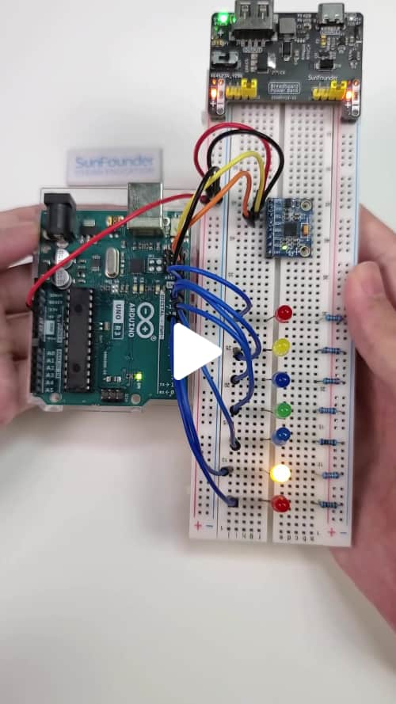

# MPU6050 LED Tilt Control

This project controls an array of LEDs based on the tilt angle detected by an MPU6050 sensor. The LEDs illuminate in response to X-axis tilt, visually indicating the board's orientation. Tilt angles are continuously calculated from acceleration data provided by the MPU6050, and corresponding LEDs activate according to predefined angle thresholds.

<a href="https://www.tiktok.com/@sunfounder_official/video/7425069067448438046" title="Control LEDs with Tilt! MPU6050 Sensor and Arduino Magic" target="_blank">
    
</a>


## Components

| Component Introduction         | Purchase Link  |
|--------------------------------|----------------|
| [Arduino Uno R4(or R3)](https://docs.sunfounder.com/projects/elite-explorer-kit/en/latest/components/component_uno.html#uno-r4-wifi)       | -              |
| [MPU6050 Module](https://docs.sunfounder.com/projects/ultimate-sensor-kit/en/latest/components_basic/05-component_mpu6050.html)       | -              |
| [LED](https://docs.sunfounder.com/projects/elite-explorer-kit/en/latest/basic_projects/10_basic_led.html)       | [BUY](https://www.sunfounder.com/products/500pcs-5-colors-x-100pcs-5mm-leds-with-white-red-yellow-green-blue-colors-kit-box?ref=tiktok1&utm_source=github)               |
| [Breadboard](https://docs.sunfounder.com/projects/umsk/en/latest/01_components_basic/38-component_breadboard.html#breadboard)                | [BUY](https://www.sunfounder.com/products/20pcs-3-5v-2-terminals-passive-buzzer?ref=tiktok1&utm_source=github)       |
| [Jumper Wires](https://docs.sunfounder.com/projects/elite-explorer-kit/en/latest/components/component_wires.html#cpn-wires)              | [BUY](https://www.sunfounder.com/products/560pcs-jumper-wire-kit-with-14-lengths?ref=tiktok1&utm_source=github)       |

## Circuit Diagram

Refer to the image below for the circuit setup:


## Arduino Code

Open the `LEDTiltControl.ino` file in the `LEDTiltControl` folder.

> [!IMPORTANT]
> To install the library, use the Arduino Library Manager and search for “**MPU6050**” and install it.

```c++
#include <Wire.h>
#include <MPU6050.h>

MPU6050 mpu;

// LED pins 7-13 on Arduino
const int ledPins[] = {13, 12, 11, 10, 9, 8, 7}; 
int ledCount = sizeof(ledPins) / sizeof(ledPins[0]); // LED count

// Tilt angle thresholds for LEDs
const float thresholds[] = {-30, -15, -5, 5, 15, 30};

void setup() {
  Wire.begin(); // Init I2C
  Serial.begin(9600); // Init serial
  
  // Init MPU6050
  mpu.initialize(); 
  if (!mpu.testConnection()) {
    Serial.println("MPU6050 connection failed");
    while (1); // Stop if MPU6050 fails
  }
  
  // Set LED pins as output
  for (int i = 0; i < ledCount; i++) {
    pinMode(ledPins[i], OUTPUT);
  }
}

void loop() {
  int16_t ax, ay, az; // Acceleration data
  
  // Get MPU6050 acceleration
  mpu.getAcceleration(&ax, &ay, &az);
  
  // Calculate tilt angle (X-axis)
  float angleX = atan2(ay, az) * 180 / PI;
  
  // Update LEDs based on angle
  updateLEDs(angleX);
  
  delay(100); // Stabilize output
}

// Update LEDs based on angle
void updateLEDs(float angleX) {
  // Turn off all LEDs
  for (int i = 0; i < ledCount; i++) {
    digitalWrite(ledPins[i], LOW);
  }

  // Get the LED index for the angle
  int ledIndex = getLEDIndex(angleX);

  // Turn on the correct LED
  if (ledIndex >= 0 && ledIndex < ledCount) {
    digitalWrite(ledPins[ledIndex], HIGH);
  }
}

// Determine the LED index for the angle
int getLEDIndex(float angleX) {
  // Find the matching LED
  for (int i = 0; i < ledCount - 1; i++) {
    if (angleX < thresholds[i]) {
      return i; // Return matching LED index
    }
  }
  return ledCount - 1; // Return last LED if angle exceeds thresholds
}
```

## Join Our Community

Welcome to the SunFounder Raspberry Pi & Arduino & ESP32 Enthusiasts Community on Facebook! Dive deeper into Raspberry Pi, Arduino, and ESP32 with fellow enthusiasts.

https://www.facebook.com/share/LDYGqFDKJC7G4V5M/?mibextid=CTbP7E
