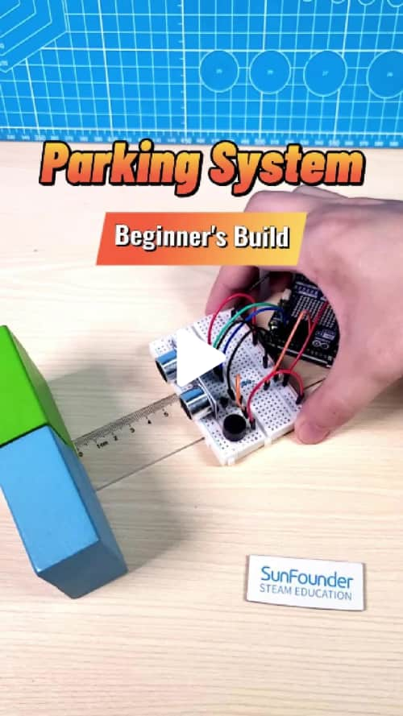
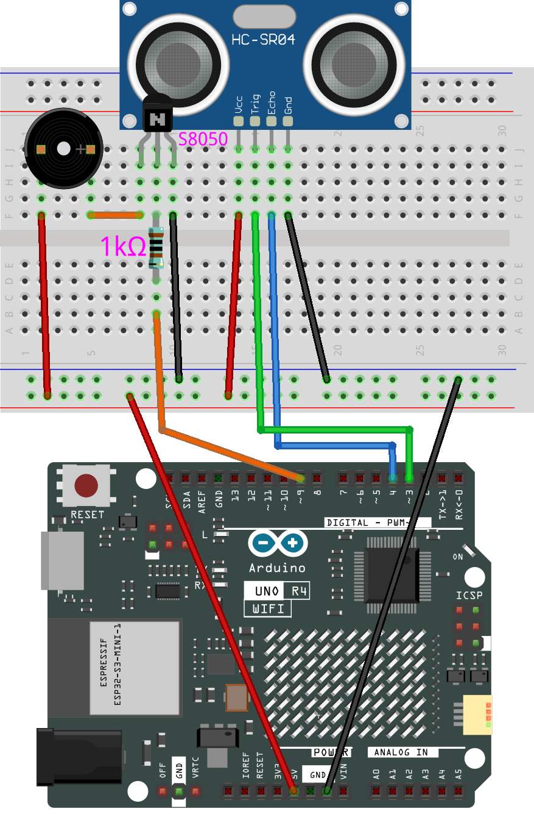

# Arduino Reversing System

 This project is a distance measuring and alerting system using an ultrasonic sensor and a buzzer. The system measures the distance to an object and sounds the buzzer at different frequencies based on the distance: closer objects trigger higher frequency tones, and as the object moves away, the frequency decreases. If no objects are detected within a minimal threshold distance recently, it stops the buzzer.

[](https://www.tiktok.com/@sunfounder_official/video/7383559146429254942 "Arduino Reversing System")


## Components

| Component Introduction         | Purchase Link  |
|--------------------------------|----------------|
| [Arduino Uno R4(or R3)](https://docs.sunfounder.com/projects/elite-explorer-kit/en/latest/components/component_uno.html#uno-r4-wifi)       | -              |
| [Ultrasonic Module](https://docs.sunfounder.com/projects/elite-explorer-kit/en/latest/components/component_ultrasonic_sensor.html#cpn-ultrasonic)         | [BUY](https://www.sunfounder.com/products/5pcs-hc-sr04-ultrasonic-module-distance-sensor)       |
| [Passive Buzzer](https://docs.sunfounder.com/projects/elite-explorer-kit/en/latest/components/component_buzzer.html#cpn-buzzer)                     | [BUY](https://www.sunfounder.com/products/20pcs-3-5v-2-terminals-passive-buzzer)       |
| [Resistor](https://docs.sunfounder.com/projects/elite-explorer-kit/en/latest/components/component_resistor.html#cpn-resistor)                     | [BUY](https://www.sunfounder.com/products/1-4w-resistor-assortment-kit-40-values-400pcs)       |
| [Transistor](https://docs.sunfounder.com/projects/elite-explorer-kit/en/latest/components/component_transistor.html#cpn-transistor)                     | [BUY](https://www.sunfounder.com/products/10-values-200pcs-power-supply-general-transistor-npn-pnp-assortment-kit-bc337-bc327-2n2222-2n2907-2n3904-2n3906-s8050-s8550-a1015-c1815-set)       |
| [Breadboard](https://docs.sunfounder.com/projects/elite-explorer-kit/en/latest/components/component_buzzer.html#buzzer)                | [BUY](https://www.sunfounder.com/products/20pcs-3-5v-2-terminals-passive-buzzer)       |
| [Jumper Wires](https://docs.sunfounder.com/projects/elite-explorer-kit/en/latest/components/component_wires.html#cpn-wires)              | [BUY](https://www.sunfounder.com/products/560pcs-jumper-wire-kit-with-14-lengths)       |

## Circuit Diagram

Refer to the image below for the circuit setup:



## Arduino Code

Open the `ReversingSystem.ino` file in the `ReversingSystem` folder.

```arduino
const int echoPin = 4;      // Ultrasonic sensor echo pin
const int trigPin = 3;      // Ultrasonic sensor trigger pin
const int buzzerPin = 9;    // Buzzer pin

unsigned long previousMillis = 0;  // Last time the buzzer was activated
unsigned long buzzerInterval = 0;  // Minimum interval between buzzer sounds

void setup() {
  Serial.begin(9600);            // Initialize serial communication at 9600 baud
  pinMode(echoPin, INPUT);       // Set echo pin as input
  pinMode(trigPin, OUTPUT);      // Set trigger pin as output
  pinMode(buzzerPin, OUTPUT);    // Set buzzer pin as output
}

void loop() {
  float distance = readDistance();  // Measure distance
  Serial.print(distance);           // Output distance to serial monitor
  Serial.println(" cm");            // Append units and new line

  manageBuzzer(distance);           // Adjust buzzer based on distance
}

void manageBuzzer(float distance) {
  unsigned long currentMillis = millis(); // Get current time

  // High frequency for close objects
  if (distance < 5 && currentMillis - previousMillis >= 100) {
    tone(buzzerPin, 1047, 100);    // Play tone
    previousMillis = currentMillis;
    buzzerInterval = 100;  
  } 
  // Medium frequency for medium distance
  else if (distance < 10 && currentMillis - previousMillis >= 300) {
    tone(buzzerPin, 523, 100);     // Play tone
    previousMillis = currentMillis;
    buzzerInterval = 300;  
  } 
  // Low frequency for distant objects
  else if (distance < 15 && currentMillis - previousMillis >= 500) {
    tone(buzzerPin, 262, 100);     // Play tone
    previousMillis = currentMillis;
    buzzerInterval = 500;  
  } 
  // Silence if no close objects detected recently
  else if (currentMillis - previousMillis >= buzzerInterval) {
    noTone(buzzerPin);             // Stop tone
  }
}

float readDistance() {
  digitalWrite(trigPin, LOW);       // Clear trigger pin
  delayMicroseconds(2);             // Stabilize line
  digitalWrite(trigPin, HIGH);      // Trigger pulse
  delayMicroseconds(10);            // Pulse duration
  digitalWrite(trigPin, LOW);       // End pulse
  float duration = pulseIn(echoPin, HIGH); // Read echo pulse
  return duration / 58.0;           // Convert to cm
}
```

## Join Our Community

Welcome to the SunFounder Raspberry Pi & Arduino & ESP32 Enthusiasts Community on Facebook! Dive deeper into Raspberry Pi, Arduino, and ESP32 with fellow enthusiasts.

https://www.facebook.com/share/LDYGqFDKJC7G4V5M/?mibextid=CTbP7E

## Reference

- [Passive Buzzer Basic Project](https://docs.sunfounder.com/projects/elite-explorer-kit/en/latest/basic_projects/16_basic_passive_buzzer.html#passive-buzzer)
- [Ultrasonic Sensor Basic Project](https://docs.sunfounder.com/projects/elite-explorer-kit/en/latest/basic_projects/06_basic_ultrasonic_sensor.html#ultrasonic)
